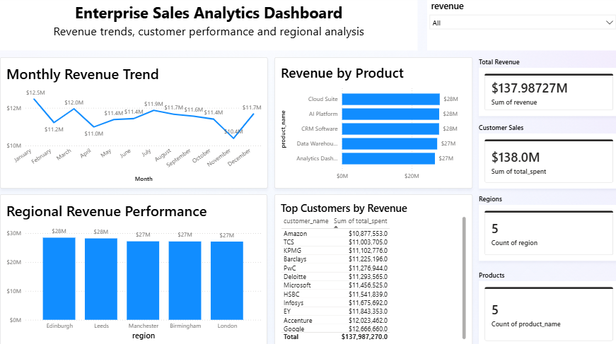

---

# Enterprise Sales Data Pipeline & Analytics Platform

An end-to-end Data Engineering project that demonstrates the complete lifecycle of enterprise sales data, from data generation and ETL processing to database management, SQL analytics, and interactive business intelligence reporting. The project uses Python and Pandas to generate and transform synthetic sales data, PostgreSQL for structured data storage, SQL for analytical queries, and Power BI to create an interactive dashboard that provides insights into revenue trends, regional performance, product sales, and customer behavior. This project simulates a real-world enterprise analytics workflow and showcases practical skills in data engineering, database management, and data visualization.
```

---

## 📖 Overview

This project demonstrates an end-to-end Data Engineering pipeline designed to process, transform, store, and analyze enterprise sales data. The workflow begins with the generation of synthetic sales data using Python, followed by data cleaning and transformation using Pandas as part of the ETL process. The processed data is then loaded into a PostgreSQL database, where SQL queries are used to generate meaningful business insights. Finally, the data is visualized through an interactive Power BI dashboard, enabling analysis of key performance indicators such as revenue, customer behavior, regional sales performance, product performance, and sales trends. This project simulates a real-world enterprise analytics solution and highlights practical skills in Python, SQL, PostgreSQL, ETL development, and business intelligence.
```

---

## 🏗️ Data Pipeline Architecture

The project follows a structured end-to-end data engineering workflow that transforms raw sales data into actionable business insights. The pipeline begins with synthetic data generation, followed by data extraction, cleaning, validation, and transformation using Python and Pandas. The processed data is then loaded into a PostgreSQL database, where SQL queries are used to perform analytical operations. Finally, the processed data is connected to Power BI to create an interactive dashboard for business reporting and decision-making.

```text
┌─────────────────────────────┐
│  Synthetic Sales Data       │
└──────────────┬──────────────┘
               │
               ▼
┌─────────────────────────────┐
│ Python Data Generation      │
└──────────────┬──────────────┘
               │
               ▼
┌─────────────────────────────┐
│ ETL Processing (Pandas)     │
│ • Cleaning                  │
│ • Transformation            │
│ • Validation                │
└──────────────┬──────────────┘
               │
               ▼
┌─────────────────────────────┐
│ PostgreSQL Database         │
└──────────────┬──────────────┘
               │
               ▼
┌─────────────────────────────┐
│ SQL Analysis & Queries      │
└──────────────┬──────────────┘
               │
               ▼
┌─────────────────────────────┐
│ Power BI Dashboard          │
└──────────────┬──────────────┘
               │
               ▼
┌─────────────────────────────┐
│ Business Insights           │
└─────────────────────────────┘
```

---

## ✨ Key Features

- Developed an end-to-end data engineering pipeline for enterprise sales analytics.
- Generated a synthetic sales dataset containing over 10,000 transaction records.
- Implemented an ETL (Extract, Transform, Load) pipeline using Python and Pandas.
- Performed data cleaning, preprocessing, and validation to ensure data quality.
- Loaded transformed data into a PostgreSQL relational database.
- Designed SQL queries to analyze sales performance, customer behavior, and revenue trends.
- Built an interactive Power BI dashboard with dynamic visualizations and key business KPIs.
- Visualized monthly revenue trends, regional sales performance, product-wise revenue, and top customers.
- Structured the project using industry-standard folder organization and version control with Git and GitHub.
- Demonstrated practical skills in data engineering, SQL analytics, business intelligence, and data visualization.
```

---
## 🛠️ Technology Stack

### Programming Languages
- Python

### Python Libraries
- Pandas
- NumPy
- Psycopg2

### Database
- PostgreSQL
- SQL

### Data Engineering
- ETL (Extract, Transform, Load)
- Data Cleaning & Preprocessing
- Data Validation
- Data Transformation

### Data Visualization
- Microsoft Power BI

### Development Tools
- Visual Studio Code
- Git
- GitHub

### Project Management
- Version Control with Git
- Repository Hosting with GitHub
```

---

## 📊 Dataset

This project utilizes a synthetic enterprise sales dataset created to simulate real-world business transactions. The dataset contains over 10,000 sales records and includes customer information, product details, order information, sales amounts, revenue, regional data, and transaction dates. It was designed to support ETL processing, SQL-based analytical queries, and interactive business intelligence reporting.

### Dataset Includes

- Customer ID and Customer Name
- Product ID and Product Name
- Product Category
- Order ID
- Order Date
- Quantity Sold
- Unit Price
- Total Revenue
- Sales Region
- Payment Method (if applicable)

### Dataset Size

- **10,000+ Sales Transactions**
- **Multiple Product Categories**
- **Multiple Sales Regions**
- **Designed for ETL, SQL Analytics, and Power BI Reporting**
```

---

## 📂 Project Structure

```text
enterprise-sales-data-pipeline/
│
├── data/
│   └── raw/
│       └── sales_data.csv             # Raw synthetic sales dataset
│
├── images/
│   └── dashboard.png                  # Power BI dashboard screenshot
│
├── scripts/
│   ├── generate_sales_data.py         # Generates synthetic sales data
│   ├── load_to_postgres.py            # Loads processed data into PostgreSQL
│   └── test.py                        # Testing script
│
├── sql/
│   └── 01_create_sales_table.sql      # Database table creation script
│
├── .gitignore
├── README.md
└── requirements.txt
```
```
```

---

## 🔄 ETL Pipeline

The project follows a standard **Extract, Transform, Load (ETL)** process to ensure that raw sales data is converted into clean, structured, and analysis-ready information.

### 📥 Extract

- Generated a synthetic enterprise sales dataset using Python.
- Imported raw sales data into the Python environment for processing.
- Validated data availability before transformation.

### 🔧 Transform

- Cleaned and standardized the dataset.
- Removed duplicate records and handled missing values.
- Converted data into appropriate formats.
- Performed data validation and quality checks.
- Created derived fields required for business analysis.
- Prepared the dataset for efficient storage and reporting.

### 📤 Load

- Loaded the transformed dataset into a PostgreSQL database.
- Created structured database tables using SQL.
- Verified successful data loading.
- Enabled the processed data for SQL analysis and Power BI visualization.

### ETL Workflow

```text
Raw Sales Data
        │
        ▼
Data Extraction
        │
        ▼
Data Cleaning & Validation
        │
        ▼
Data Transformation
        │
        ▼
PostgreSQL Database
        │
        ▼
SQL Analytics
        │
        ▼
Power BI Dashboard
```
```

---

## 📈 SQL Analysis

SQL was used to perform analytical queries on the processed sales data stored in PostgreSQL. These queries generated meaningful business insights by identifying sales trends, customer purchasing behavior, regional performance, and product-wise revenue. The results of these analyses served as the foundation for the Power BI dashboard.

### Business Insights Generated

- Calculated total sales revenue and total number of orders.
- Identified top-performing products based on revenue.
- Analyzed monthly sales and revenue trends.
- Compared sales performance across different regions.
- Identified high-value customers based on purchase history.
- Calculated average revenue per transaction.
- Evaluated product-wise sales contribution.
- Generated summary statistics to support business decision-making.

### Sample SQL Operations

- Aggregate Functions (`SUM`, `AVG`, `COUNT`)
- Grouping (`GROUP BY`)
- Sorting (`ORDER BY`)
- Filtering (`WHERE`)
- Date-based Analysis
- Data Aggregation
- Revenue Calculations

The analytical SQL queries transformed raw transactional data into actionable business insights, enabling effective reporting and data-driven decision-making through the Power BI dashboard.
```

---

## 📊 Power BI Dashboard

An interactive Power BI dashboard was developed to transform processed sales data into meaningful visual insights. The dashboard enables users to monitor key business metrics, analyze sales performance, and identify trends through dynamic charts, KPI cards, and tables.

### Dashboard Highlights

- 📈 Total Revenue KPI
- 👥 Total Customers
- 📦 Total Products
- 🌍 Regional Sales Performance
- 📅 Monthly Revenue Trend
- 🛒 Product-wise Revenue Analysis
- 🏆 Top Customers by Revenue
- 🔍 Interactive Filters and Slicers

### Business Insights

The dashboard helps answer key business questions such as:

- Which products generate the highest revenue?
- Which regions contribute the most to overall sales?
- How does revenue vary across different months?
- Who are the top-performing customers?
- What are the overall sales trends and KPIs?

### Dashboard Preview

<p align="center">
  
</p>

```

---

## ▶️ How to Run the Project

### 1️⃣ Clone the Repository

```bash
git clone https://github.com/benitya/enterprise-sales-data-pipeline.git
cd enterprise-sales-data-pipeline
```

### 2️⃣ Install Dependencies

```bash
pip install -r requirements.txt
```

### 3️⃣ Configure PostgreSQL

- Install PostgreSQL.
- Create a new database.
- Update the database connection details in `scripts/load_to_postgres.py`.

### 4️⃣ Generate the Dataset

```bash
python scripts/generate_sales_data.py
```

This generates the synthetic enterprise sales dataset.

### 5️⃣ Load Data into PostgreSQL

```bash
python scripts/load_to_postgres.py
```

### 6️⃣ Execute SQL Script

Run the following SQL script in PostgreSQL to create the required database table:

```text
sql/01_create_sales_table.sql
```

### 7️⃣ Open the Power BI Dashboard

Open the Power BI dashboard (.pbix file) in Microsoft Power BI Desktop and connect it to the PostgreSQL database to explore the interactive sales analytics dashboard.
```

---

## 🚀 Future Enhancements

The project can be further enhanced by incorporating advanced data engineering and analytics capabilities, including:

- Implement workflow orchestration using Apache Airflow.
- Automate data ingestion and ETL scheduling.
- Deploy the pipeline on cloud platforms such as Microsoft Azure or Amazon Web Services (AWS).
- Integrate real-time data streaming using Apache Kafka.
- Develop machine learning models for sales forecasting and customer segmentation.
- Automate Power BI dashboard refresh using scheduled data pipelines.
- Implement data quality monitoring and logging.
- Containerize the application using Docker for improved deployment and scalability.
- Expand the project by integrating additional enterprise datasets and advanced business KPIs.
```

---

## 👩‍💻 Author

**Nitya Bhave**

B.E. Computer Engineering | Data Engineering | SQL | Python | PostgreSQL | Power BI

GitHub: https://github.com/benitya

Feel free to explore the repository.
```

